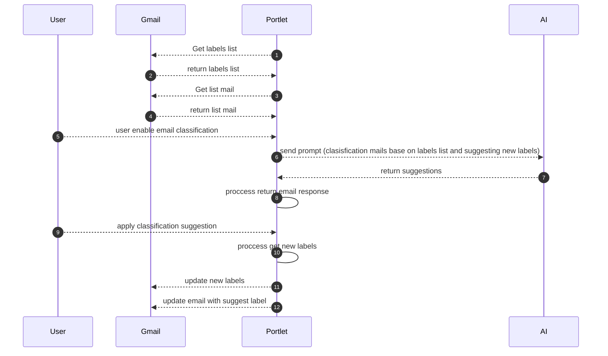

# Email classification

```mermaid
sequenceDiagram

participant u as User
participant g as Gmail
participant p as Portlet
participant a as AI
autonumber

p -->> g: Get labels list
g -->> p: return labels list
p -->> g: Get list mail
g -->> p: return list mail

u -->> p: user enable email classification

p -->> a: send prompt (clasisfication mails base on labels list and suggesting new labels)
a -->> p: return suggestions

p -> p: proccess return email response

u -->> p: apply classification suggestion

p -> p: proccess get new labels
p -->> g: update new labels
p -->> g: update email with suggest label

```