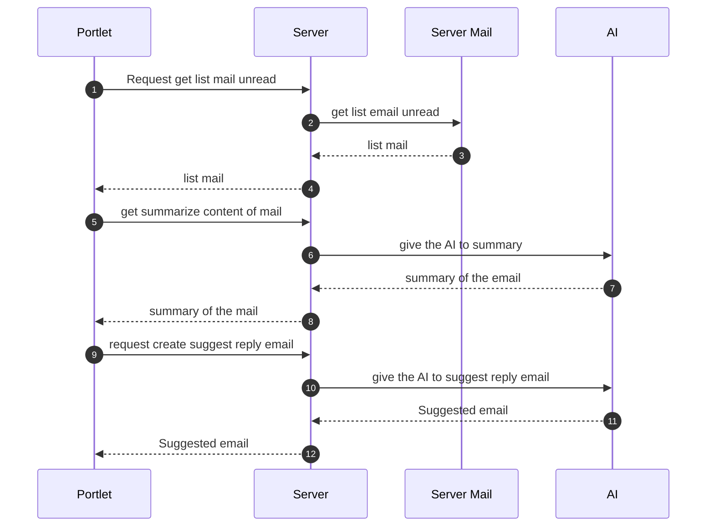

# Summarize message and suggest reply

```mermaid
sequenceDiagram

participant p as Portlet
participant s as Server
participant m as Server Mail
participant AI
autonumber

p ->> s: Request get list mail unread
s ->> m: get list email unread
m -->> s: list mail
s -->> p: list mail

p ->> s: get summarize content of mail
s ->> AI: give the AI to summary
AI -->> s: summary of the email
s -->> p: summary of the mail

p ->> s: request create suggest reply email
s ->> AI: give the AI to suggest reply email
AI -->> s: Suggested email
s -->> p: Suggested email
```