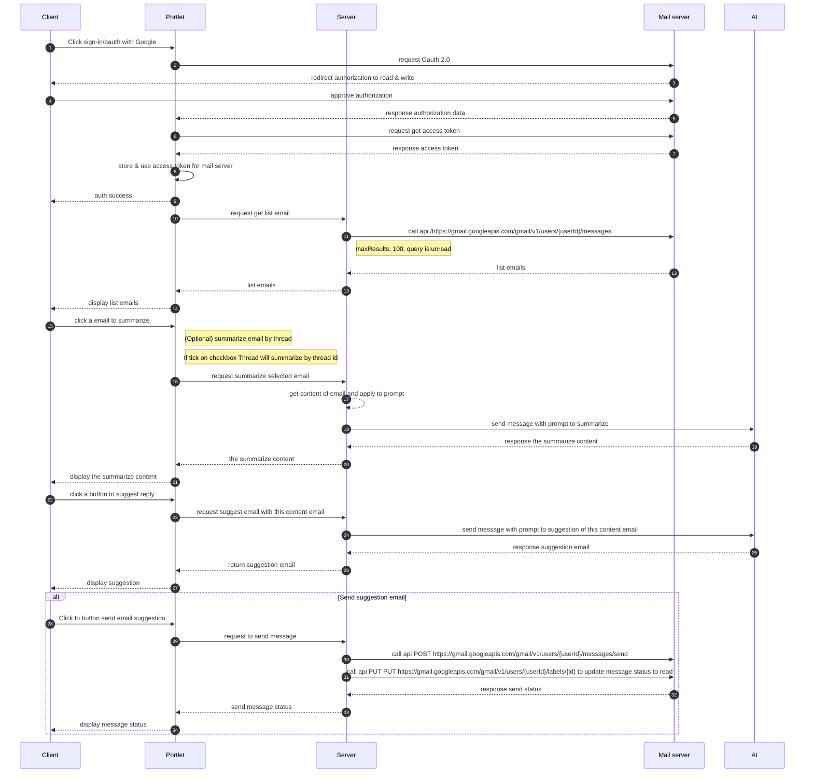

# Sequence detail

```mermaid
sequenceDiagram
    autonumber
    participant c as Client
    participant p as Portlet
    participant s as Server
    participant m as Mail server
    participant ai as AI
    
    c ->> p: Click sign-in/oauth with Google
    p ->> m: request Oauth 2.0
    m -->> c: redirect authorization to read & write
    c ->> m: approve authorization
    m -->> p: response authorization data
    p ->> m: request get access token
    m -->> p: response access token
    p ->> p: store & use access token for mail server
    p -->> c: auth success
    
    p ->> s: request get list email
    s ->> m: call api /https://gmail.googleapis.com/gmail/v1/users/{userId}/messages
    Note right of s: maxResults: 100, query is:unread
    m -->> s: list emails
    s -->> p: list emails
    p -->> c: display list emails
    
    c ->> p: click a email to summarize
    Note right of p: (Optional) summarize email by thread
    Note right of p: If tick on checkbox Thread will summarize by thread id
    
    p ->> s: request summarize selected email
    s -->> s: get content of email and apply to prompt
    s ->> ai: send message with prompt to summarize
    ai -->> s: response the summarize content
    s -->> p: the summarize content
    p -->> c: display the summarize content

    c ->> p: click a button to suggest reply
    p ->> s: request suggest email with this content email
    s ->> ai: send message with prompt to suggestion of this content email
    ai -->> s: response suggestion email
    s -->> p: return suggestion email
    p -->> c: display suggestion
    
    alt Send suggestion email
    c ->> p: Click to button send email suggestion
    p ->> s: request to send message
    s ->> m: call api POST https://gmail.googleapis.com/gmail/v1/users/{userId}/messages/send
    s ->> m: call api PUT PUT https://gmail.googleapis.com/gmail/v1/users/{userId}/labels/{id} to update message status to read
    m -->> s: response send status
    s -->> p: send message status
    p -->> c: display message status
    end
    
```